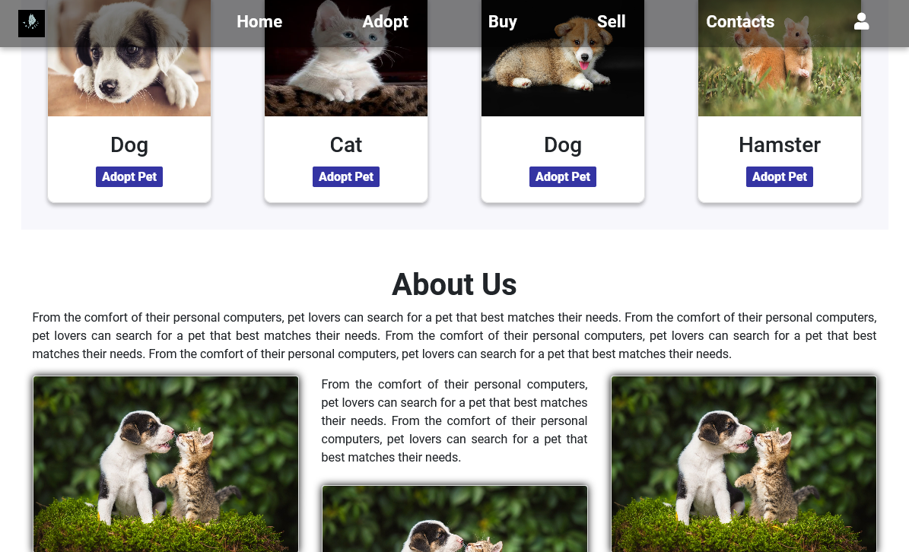

# PetSite.

## A peek of the page



## Table of Content

+ [Description](#Description)
+ [Languages](##Languagesused)
+ [Usage](##Tousethetemplate)
+ [Contributing](##Contributing)
+ [Reference](#reference)
+ [Licence](##Licence)
+ [Author](##Author)

## Description
This is the landing page for PetSite website.

* [Click here to view site](https://lyonsmasawa.github.io/Pet-Site/)

## Language used
This page is made with HTML, CSS, JS and jQuery.
  - HTML for the page structure.
  - BOOTSTRAP for responsiveness.
  - CSS for the page styling.
  - JS for functionality.
  - JQUERY for effects.

## To use the template.
```

## Usage
* Requirements

> A device able to display a webpage.

> A code editor.

> Basic knowledge on HTML, CSS, JS and JQUERY.

* Installation

> Clone repository or click on the download code button.

> customize to your liking.

```

## Contributing
Pull requests are welcome at all times. the more the merrier

Please make sure you update the branches when you make changes on plus a detailed guideline(commits) of changes made.

## Reference
* Basics of HTML CSS and JS.

## License
[MIT Licence](https://github.com/Lyonsmasawa/Pet-Site/blob/facfc61ec875012776a858462adef70a2496e548/LICENSE)

Copyright (c) 2022 Pet-Site

Permission is hereby granted, free of charge, to any person obtaining a copy
of this software and associated documentation files (the "Software"), to deal
in the Software without restriction, including without limitation the rights
to use, copy, modify, merge, publish, distribute, sublicense, and/or sell
copies of the Software, and to permit persons to whom the Software is
furnished to do so, subject to the following conditions:

The above copyright notice and this permission notice shall be included in all
copies or substantial portions of the Software.

THE SOFTWARE IS PROVIDED "AS IS", WITHOUT WARRANTY OF ANY KIND, EXPRESS OR
IMPLIED, INCLUDING BUT NOT LIMITED TO THE WARRANTIES OF MERCHANTABILITY,
FITNESS FOR A PARTICULAR PURPOSE AND NONINFRINGEMENT. IN NO EVENT SHALL THE
AUTHORS OR COPYRIGHT HOLDERS BE LIABLE FOR ANY CLAIM, DAMAGES OR OTHER
LIABILITY, WHETHER IN AN ACTION OF CONTRACT, TORT OR OTHERWISE, ARISING FROM,
OUT OF OR IN CONNECTION WITH THE SOFTWARE OR THE USE OR OTHER DEALINGS IN THE
SOFTWARE.


## Author
* Lyons Albert Masawa.

## Contributors
* Lewis Murgor.
* Mary Gathuku.

[Go Back to the top](#PetSite)